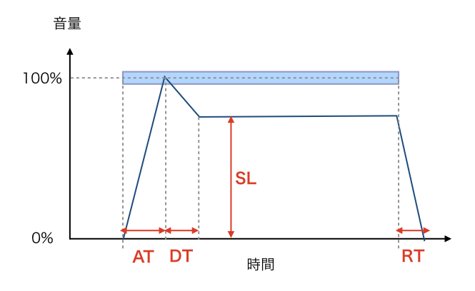
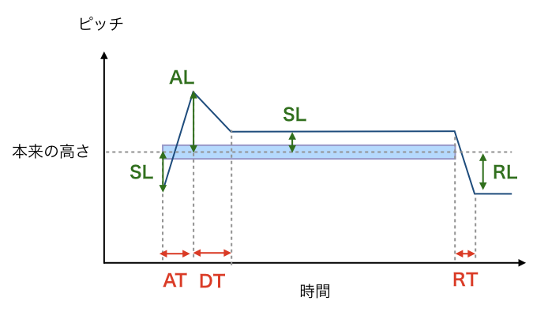
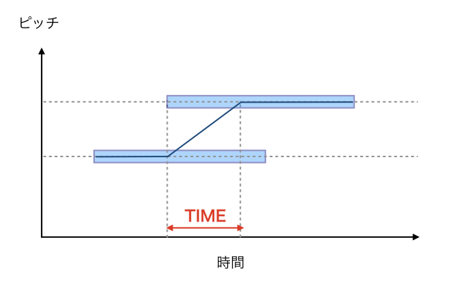

# Kamata

## 音色調整
右下の黄色いボタンを押すと出てくるいろんなパラメータについて。

### AMP ENV
バンブラでいうエンベロープ。音量の変化を設定できる。

- AT: 音量がMAXになるまでの時間
- DT: 音量がMAX→SLまで落ちるまでの時間
- SL: 持続する音の音量
- RT: 音が完全に消えるまでの時間

### PITCH ENV
音高のをAMP ENVと同じように変化させることができる。
上段「○T」で時間を、下段「○L」で高さを指定する。

- AT: SL ~ ALの移行時間
- DT: AL ~ SLの移行時間
- RT: SL ~ RLの移行時間

- SL(StartLevel) : 発音時の音高
- AL: 発音時〜持続音までに通過する音高（ことばでうまくいえないんじゃ）
- SL(SustainLevel): 持続音の音高
- RL: リリース音の音高（AMP ENVでRTが0の場合は無効）

### DELAY
ディレイをかける。
（同じ高さ・長さの音を指定した回数だけ反復する）

- TIME: ディレイ音の間隔
- CONT: ディレイの回数 (0~8 0=ディレイOFF)
- LEVEL: ディレイの音量（0~100% ひとつ前の音量を100%とする）

### REVERB
リバーブをかける。
（音符が切れたあと、指定した長さ・音量で音が伸びる。）

- TIME: リバーブ音の長さ
- LEVEL: リバーブの音量

### LFO1-AMP
バンブラでいう音量のモジュレーション。

- WAVE: 音量変化の波形（サイン波、矩形波、のこぎり波、三角波）
- DEPT: 音量変化の大きさ（0~100% 0=OFF）
- DELT: 変化し始めるまでの時間
- RATE: 変化の周期

### LFO2-PITCH
バンブラでいうピッチのモジュレーション。
パラメータはDEPT以外はLFO1と同じ。
- DEPT: -2400 ~ +2400 （1200で1オクターブ）
マイナスにすると波形が反転する。

### PORTAMENT
和音を使えなくする代わりに、音をなめらかに変化させることができる。
たいへん便利なので、このためにKamataを使うことも多いです。

- MODE: 
 - Poly: 2音以上の同時発音が可能
 - Mono: 1音しか発音できない
- TIME: Monoのときに、重なった音になめらかに移行する時間

### CONTROL
よくわからん（オートメーションまわりの設定っぽい。）
- MOD-WHEEL: オートメーション `Mod Wheel` の対象（Pitch / Amp / Off）
PitchかAmpに指定するとLFOは無効化されるっぽいので、使わなければOffで。
- P-BEND: オートメーション `Pitch Bend` の幅（+2 ~ +24）